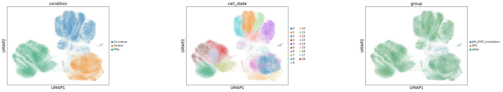
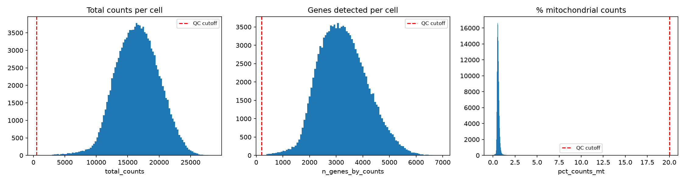
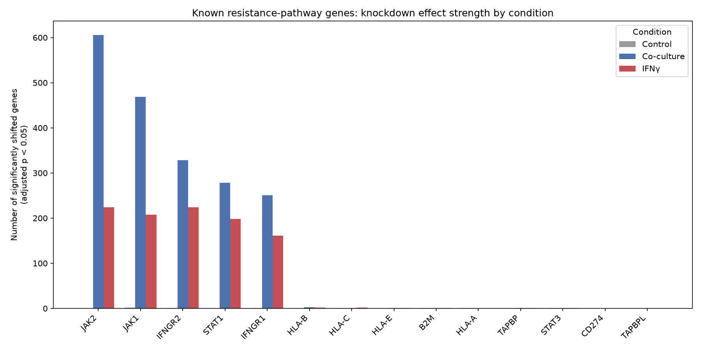
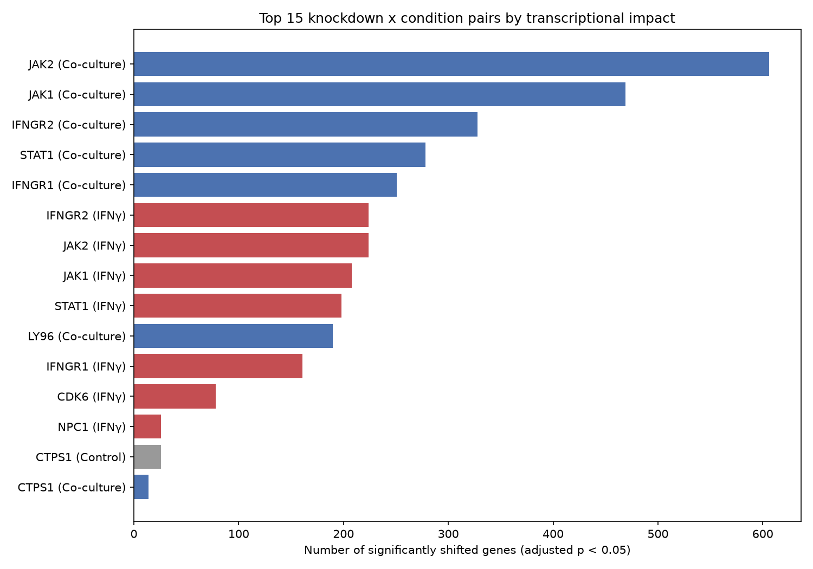
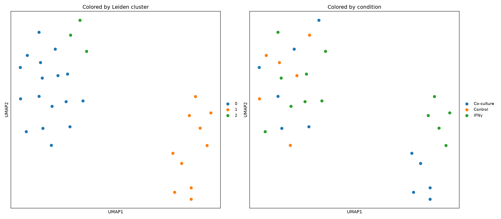
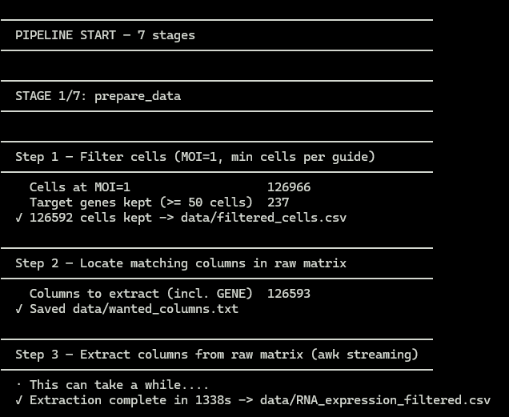
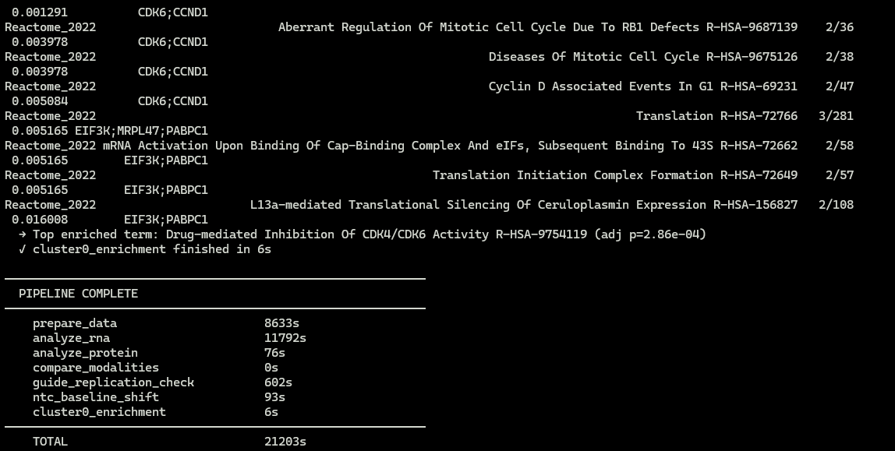
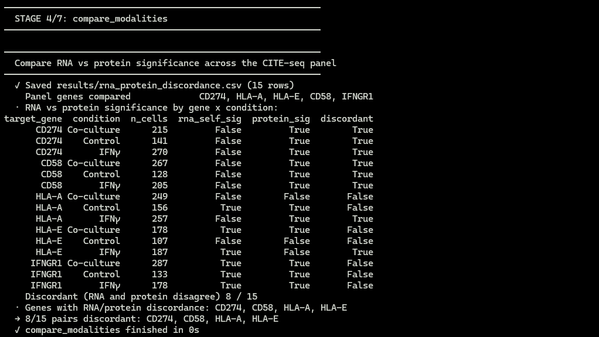

<div align="center">

# 🧬 Perturb-CITE-seq Melanoma Immune Evasion Pipeline

**Single-cell RNA + protein CRISPR perturbation screen analysis, decoding how melanoma cells evade cytotoxic T-cell killing**

[](#)
[](LICENSE)
[](#)
[](#)

</div>

---

## Overview

This pipeline analyzes the **Frangieh et al. 2021** Perturb-CITE-seq dataset (SCP1064): **218,331 melanoma cells** across **3 conditions** (Control, Co-culture with cytotoxic T-cells, IFN-γ stimulation), screened against **248 CRISPR gene knockdowns**, to find genes that drive melanoma's resistance to immune attack.

After MOI=1 filtering and a minimum-cells-per-guide threshold, the final analyzed cohort is **126,592 cells x 23,712 genes**. It runs both RNA and surface protein (CITE-seq / ADT) modalities through parallel analysis, then cross-checks them against each other. That cross-check is where the interesting biology shows up: **some of the genes that matter most for immune evasion are invisible at the RNA level and only show up in protein.**

A single command (`python run_all.py`) takes you from raw data to validated, publication-style figures and result tables. No flags, no manual steps.

---

## 🔑 Key Findings

**1. The JAK/STAT resistance module is real, and it's consistent.**
`JAK2` is the single strongest perturbation in the entire screen (606 significantly shifted genes in Co-culture), followed closely by `JAK1`, `IFNGR2`, `STAT1`, and `IFNGR1`. This module clusters together on its own (Leiden cluster 1 of the perturbation-signature UMAP) and replicates consistently across independent sgRNAs targeting the same gene, confirmed across five separate validation checks, not just one clustering run that happened to look right.

**2. CD274 (PD-L1) and CD58 are RNA-silent but protein-significant, across all three conditions.**
Standard scRNA-seq differential expression finds nothing here, both genes show no RNA-level significance in Control, Co-culture, or IFN-γ. But at the **protein** level, both are significant in all three conditions. If you only ran a standard RNA-seq pipeline, you'd miss two of the most immunologically relevant surface proteins in the entire screen. This is the core argument for why multi-modal (RNA + protein) analysis matters in perturbation screens.

**3. Cross-modality discordance isn't rare: 8 of 15 gene x condition pairs on the CITE-seq panel disagree between RNA and protein** (CD274, CD58, HLA-A, HLA-E), underscoring that RNA-only screens systematically miss real immune-relevant signal.

**4. 19 distinct cell states emerge from global clustering**, with condition-specific shifts, JAK/STAT-knockdown cells in Co-culture and IFN-γ concentrate disproportionately into distinct states (e.g. state 0 and state 6) compared to NTC cells in the same condition, visible directly in the cell-state UMAP below.

**5. Cluster 0 (of the perturbation-signature clustering) resolves to a coherent, real biological signature**: CDK4/CDK6 inhibition (Reactome, adjusted p = 2.86e-4) driven by `CDK6` and `CCND1`, not a generic essentiality artifact.

---

## 📸 Results

**Cell-state landscape** (126,592 cells, 19 states, by condition and by NTC-vs-JAK/STAT-knockdown group):



**QC thresholds applied before analysis** (red dashed line = cutoff):



**Known resistance-pathway genes, effect strength by condition:**



**Top 15 knockdown x condition pairs by transcriptional impact:**



**Perturbation-signature clustering** (one point per gene x condition pair, not per cell):



---

## 🚀 Quick Start

```bash
git clone https://github.com/Vivin-Francis/perturb-cite-seq-pipeline.git
cd perturb-cite-seq-pipeline
python3 -m venv venv
source venv/bin/activate
pip install -r requirements.txt
python run_all.py
```

That's it. One command runs the full pipeline end to end:

```
prepare_data > analyze_rna > analyze_protein > compare_modalities
> guide_replication_check > ntc_baseline_shift > cluster0_enrichment
```

Every stage stops the pipeline immediately on failure, so a broken run never silently produces partial results. Each stage prints a crisp `→` result line summarizing what it actually found, not just a completion tick.

---

## 🎬 Demo

**Pipeline start** (numbered stages, one command, no flags):



**Pipeline end** (per-stage timing summary):



**Reproducibility check** (two independent full runs, diffed byte-for-byte):



---

## 📁 Project Structure

```
scRNA-pipeline/
├── run_all.py              # single-command orchestration, no flags
├── requirements.txt
├── extract.awk              # memory-efficient extraction from the raw matrix
├── src/
│   ├── console.py            # shared logging helper, consistent output across all stages
│   ├── prepare_data.py       # chunked read + sparse AnnData construction
│   ├── analyze_rna.py        # CP10K + log1p normalization, Leiden clustering, DE testing
│   ├── analyze_protein.py    # CLR-normalized CITE-seq / ADT analysis
│   ├── compare_modalities.py # RNA vs. protein discordance analysis
│   └── validation/
│       ├── guide_replication_check.py
│       ├── ntc_baseline_shift.py
│       └── cluster0_enrichment.py
├── data/
└── results/
```

---

## 🧪 Methodology

| Step | Approach |
|---|---|
| **Data ingestion** | AWK-based extraction of the raw matrix, chunked into a sparse `AnnData` object, built to run on a memory-constrained machine, not a cluster |
| **Cell filtering** | MOI = 1 only, target genes with fewer than 50 cells dropped, standard QC on total counts / genes detected / % mitochondrial |
| **RNA normalization** | CP10K + log1p |
| **Protein normalization** | Values arrive pre-log1p-transformed on the CITE-seq panel, verified against known reference values rather than re-normalized |
| **Clustering** | Leiden, `leidenalg` flavor hardcoded (not `igraph`): switching flavors silently changes clustering results, so this is pinned for reproducibility |
| **Differential expression** | Wilcoxon rank-sum, tested independently within each condition (Control / Co-culture / IFN-γ), each knockdown vs. non-targeting controls (NTC) |
| **Cross-modality comparison** | RNA significance vs. protein significance on the shared CITE-seq panel, flagging discordant genes like CD274/CD58 |
| **Validation** | 5 independent checks: guide-level replication, NTC baseline shift across conditions, cluster 0 functional enrichment, perturbation-signature clustering, and cross-modality concordance on the JAK/STAT module |

---

## ✅ Reproducibility

This pipeline has been run end to end **twice, from separate directories, on the same codebase**, with all 8 key output CSVs (`significance_summary.csv`, `significance_long.csv`, `protein_significance.csv`, `rna_protein_discordance.csv`, `perturbation_clusters.csv`, `cluster0_enrichment.csv`, `guide_replication_check.csv`, `ntc_baseline_shift.csv`) confirmed **byte-for-byte identical** via `diff -q`. No flags, no random seeds left unpinned, no silent non-determinism.

---

## 📥 Data

This pipeline runs on the **Frangieh et al. 2021** Perturb-CITE-seq dataset, hosted on the Broad Institute's **Single Cell Portal** under accession **SCP1064**.

1. Go to the study page (a free account/login is required to download study data):
   `https://singlecell.broadinstitute.org/single_cell/study/SCP1064`
2. From the **Download** tab, pull these three files:

   | Filename | Description | Size |
   |---|---|---|
   | `RNA_expression.csv.gz` | RNA expression matrix for all cells | ~3.27 GB |
   | `RNA_metadata.csv` | Per-cell metadata (condition, MOI, guide identity) | ~11.7 MB |
   | `Protein_expression.csv.gz` | Protein (CITE-seq / ADT) expression matrix for all cells | ~5.24 MB |

   The portal also lists pre-split subset files (`RNA_expression_subset1a.csv.gz`, etc.), used only to help upload the study to the portal itself, you don't need these, the full `RNA_expression.csv.gz` is what this pipeline expects.
3. Unzip the `.gz` files and place all three into `data/` at the project root, named to match what `prepare_data.py` expects:
   - `data/RNA_expression_full.csv`
   - `data/RNA_metadata.csv`
   - `data/Protein_expression.csv`

---

## 📦 Dependencies

| Package | Purpose |
|---|---|
| `scanpy` | Core single-cell analysis (clustering, normalization, DE testing) |
| `anndata` | Sparse single-cell data structure |
| `scipy` | Sparse matrix operations |
| `pandas` | Tabular result handling |
| `leidenalg` | Community detection for clustering (flavor pinned, see Methodology) |
| `gseapy` | Functional enrichment (GO / Reactome) for the cluster 0 validation check |

Standard `pip install -r requirements.txt` setup. No conda required.

---

## 🧠 Why This Project

Most scRNA-seq portfolio pipelines stop at "cluster the cells and find marker genes." This one is built around a specific, falsifiable biological claim, that RNA-level analysis alone misses real immune-evasion signal, and then spends the majority of its effort *validating* that claim five independent ways rather than declaring victory after one clustering run.

---

## 📚 References

1. Frangieh CJ, Melms JC, Thakore PI, Geiger-Schuller KR, Ho P, Luoma AM, et al. Multimodal pooled Perturb-CITE-seq screens in patient models define mechanisms of cancer immune evasion. Nat Genet. 2021;53(3):332-41. Available from: https://doi.org/10.1038/s41588-021-00779-1

2. Broad Institute. Single Cell Portal: Multimodal pooled Perturb-CITE-Seq screens in patient models define novel mechanisms of cancer immune evasion, accession SCP1064 [Internet]. Cambridge (MA): Broad Institute; 2021 [cited 2026]. Available from: https://singlecell.broadinstitute.org/single_cell/study/SCP1064

3. Wolf FA, Angerer P, Theis FJ. SCANPY: large-scale single-cell gene expression data analysis. Genome Biol. 2018;19(1):15. Available from: https://doi.org/10.1186/s13059-017-1382-0

4. Traag VA, Waltman L, van Eck NJ. From Louvain to Leiden: guaranteeing well-connected communities. Sci Rep. 2019;9:5233. Available from: https://doi.org/10.1038/s41598-019-41695-z

---

## 📄 License

MIT

---

<div align="center">

Built by **Vivin**, MSc Bioinformatics, computational biology & single-cell genomics

</div>
